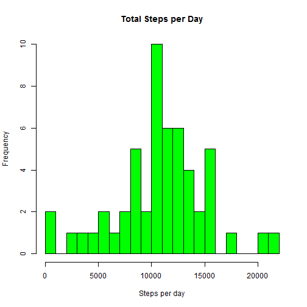
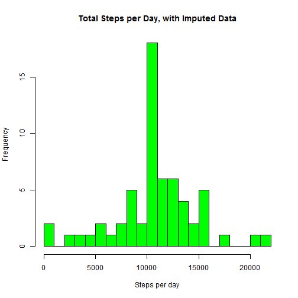

```r
knitr::opts_chunk$set(echo = TRUE,fig.path='figs/')
```

## Reproducible Research, Course Project 1

This is my report answering the questions as posed by the assignment for course project 1, Reproducible Research. The data for this exercise comes from activity monitoring hardware (FitBits, etc.), and we are to analyze this data according to the project rubric, answering a few easy questions. The data is provided, but needs to be downloaded. The data consists of the number of steps per five minute intervals over the course of 61 days (October and Novemeber of 2012) as provided by an anonymous individual. 

###Step 1:Get the data.  

The following code checks to see if the data has already been downloaded, and if not, downloads it. 


```r
## set wd 

setwd("~/R/Coursera/ReproducibleResearch")

##check to see if data file is already downloaded
temp <- tempfile()
if(!file.exists("activity.csv")){      #if not there, go get it
  download.file("https://d396qusza40orc.cloudfront.net/repdata%2Fdata%2Factivity.zip",temp)                      #download data
  unzipped <- unzip(temp)                                                                                       #unzip data
  unlink(temp)}

## Load file. 
activity <- read.csv("activity.csv")
```

### Step 2: Look at the number of steps per day

To do this we need to sum up the steps per day. 


```r
#calculate total steps per day

sumsteps <- aggregate(steps ~ date, activity, sum)
```
Then we are asked to create a histogram of steps per day.

```r
#create histogram of steps per day

hist(sumsteps$steps,
     col = "green",
     breaks = 20,
     main = "Total Steps per Day",
     xlab = "Steps per day") 
```



Now calculate the mean and median number of steps per day


```r
# calculate mean and median steps per day, ignoring NA values

mean.day <- mean(sumsteps$steps)                      # mean of steps per day  
median.day <- median(sumsteps$steps)                  # median of steps per dayplot
```
Mean = 10,766.19.

Median = 10,765.

### Step 3: Look at the activity patterns in the daily data

For this, we are going to create a time series plot of each 5 minute interval in the data, averaged per day. 

First, calculate the average steps per 5 minute interval.


```r
interval.step.average <- aggregate(steps ~ interval, activity, mean)
```

Second, plot the results. 


```r
plot(interval.step.average$interval,interval.step.average$steps, 
     type ="l", 
     xlab = "Interval",
     ylab = "Steps",
     main = "Steps per Interval, Averaged over all the days")
```


Third, determine which interval has on average the highest number of steps.


```r
max.interval <- interval.step.average[which.max(interval.step.average$steps),1]
```

Interval 835(8:35 am) has the highest mean number of steps. 

###Step 4: Impute the missing Values.

A number of the rows in the provided dataset have missing values, denoted by NA.  

First, how  many NA values are there in the data?


```r
missing <- sum(is.na(activity$steps))
total <- length(activity$steps)
```

There are 2304 intervals in the dataset with NA values out of a total of 17568 intervals.

Second, devise a strategy for filling in (imputing) the missing values. 

I propose using the mean for any given interval, as averaged over all the days in the data, as a substitute for the NA values.  

This code creates a new dataframe ("Imputed") where the NA values are substituted for the NA values.


```r
imputed <- activity                           # make copy of dataset
nas <- is.na(imputed$steps)                   # make vector of rows with NA values
imputed$steps[nas] <- interval.step.average$steps[
  match(imputed$interval[nas],interval.step.average$interval)]  # replace NA values with mean for that interval
```

Third, create a histogram of the total number of steps per day from this new dataframe, and compare it to the original data.


```r
#calculate total steps per day

sumsteps.i <- aggregate(steps ~ date, imputed, sum)

# create histogram

hist(sumsteps.i$steps,
     col = "green",
     breaks = 20,
     main = "Total Steps per Day, with Imputed Data",
     xlab = "Steps per day") 
```



Fourth, calculate the mean and median of the imputed data. 


```r
# calculate mean and median steps per day, ignoring NA values

mean.day.i <- mean(sumsteps.i$steps)                      # mean of steps per day  
median.day.i <- median(sumsteps.i$steps)                  # median of steps per dayplot
```

Mean of imputed data = 10,766.19.

Median of imputed data = 10,766.19.

Interestingly, for the imputed data, the mean and median are the same, and equal to the mean in the original data. The histogram is "steeper"; by that I mean that the days with more steps happen more often, as you would expect if you added steps everywhere there were intervals with NA.  

###Step 5: Are there differences in weekday verses weekend activity patterns?

First, split the data into two sets, weekdays and weekends.


```r
#copy the data

days.imputed <- imputed

#create variable that has "Weekend" or "Weekday" depending on day of week of date
days <- ifelse(weekdays(as.Date(imputed$date))=="Saturday"|weekdays(as.Date(imputed$date))=="Sunday","Weekend","Weekday")

#add day of the week to data
days.imputed <- cbind(imputed,days)
```
  
Now aggregate that data by Weekday/Weekend over intervals, and plot the result in 2 panel plot. 


```r
interval.dow <- aggregate(steps ~ interval + days, days.imputed, mean) 

#load ggplot2
library("ggplot2", lib.loc="~/R/win-library/3.3")

#plot 

ggplot(interval.dow, 
       aes(x =interval , 
           y=steps,
           color=days)) +
       geom_line() +
       labs(title = "Ave Daily Steps Weekday vs. Weekend", x = "Interval", y = "Total Number of Steps") +
       facet_wrap(~ days, ncol = 1, nrow=2)
```


Note that on weekends this person was less active early in the day, slightly more active during the day, and more active later at night on average that when compared to weekdays.

